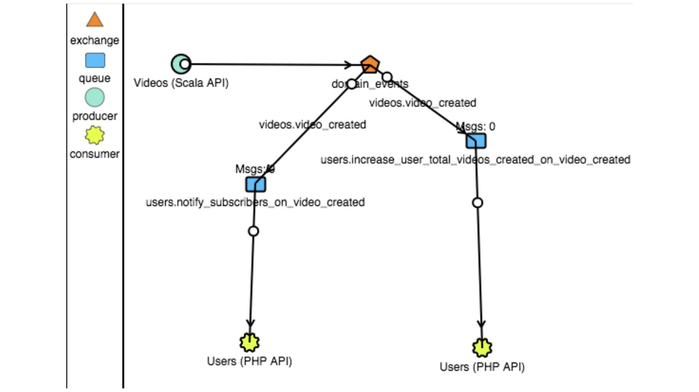

O — Open Close Principle
=============================

Introducción conceptual
-------------------------

Concepto:
- El Software (no sólo las clases) debería estar abierto a extensión y cerrado a modificación. 
Ejemplo de violación:
Si hay que calcular el salario de un empleado, dependiendo del dpto al que pertenezca se multiplica por el variable,                                                  
vamos a tener en cuanto los años de antigüedad o no, vamos a tener en cuenta bonus, etc.
Tendríamos un switch/case donde cada empleado tendría su fórmula. Problema: cada vez que añadamos un nuevo tipo de 
empleado tendremos que ir a cada uno de los switch (como calcular salario) que tengamos en nuestro código y modificarlos.

                                                                                                                                                                                                                                                                                                                                                                                                                                                                                                                                                                                                                                                                                                                                                                                                                                                                                                                                                                                                                                                                                                                                                                                                                                                                                                                                                                                                                                                                                                                                                                                                                                                                                                                                                                                                                                                                                                                                                                                                                                                                                                                                                                                                                                                                                                                                                                                                                                                                                                                                                                                                                                                                                                                                                                                                                                                                                                                                                                                                                                                                                                                                                          
- Esto aplica tanto a nuestras clases internas, servicios, microservicios, casos de usos…

Cómo conseguirlo:
- Evitando depender de implementaciones específicas, haciendo uso de clases abstractas o interfaces.
En lugar de tener un switch/case --> sacar cada case a una clase y alguien que gestione donde instancias las que quieres.
Todos los empleados tengan algo en común, p.e. TipoEmpleado a lo que se pueda acoplar y decirle a esa clase abstracta o interface
"calcúlame el sueldo" y cada subtipo o cada implementación de la interface tendría la implementación. De forma que si añadimos
un nuevo tipo de empleado simplemente implementamos esa interfaz.

Finalidad:
- Facilidad para añadir nuevos Casos de uso en nuestra aplicación.
- Código más fácil de entender
    
    Respecto al Testing, si para añadir código nuevo, hay que alterar el código que ya ha pasado el Testing Unitario,  
    estamos en una mala práctica. A parte de pasar el Testing Unitario al código nuevo, tenemos que volver a lanzar 
    las pruebas (lo que llamamos pruebas de regresión). 
    
Para seguir este principio se utiliza la **abstración**.


**Violación OCP 👎**

Clase Song:

```php
final class Song {
  private Double totalLength;
  private Double sentLength;

  public Double getSentLengthPercentage() {
    return sentLength * 100 / totalLength;
  }
}
```

Clase File:

```php
final class File {
  private Double totalLength;
  private Double sentLength;

  public Double getSentLengthPercentage() {
    return sentLength * 100 / totalLength;
  }
}
```

**Siguiendo el Principio ODP 👍**

1.  **A través de Interface ☝️**

Interface Measurable:

```php
interface Measurable {
  public Double getTotalLength();
  public Double getSentLength();
}
```


Clase Song implementando Measurable:

```php
final class Song implements Measurable {
    private Double totalLength;
    private Double sentLength;
    
    @Override
    public Double getTotalLength() {
        return totalLength;
    }
    
    @Override
    public Double getSentLength() {
        return sentLength;
    }
}
```

Hemos extraído los elementos comunes a una interface Measurable. Vemos como nuestra clase Song ahora 
implementa ésta interface y sobreescribe sus métodos rellenando el cuerpo.

Clase Progress:

```php
final class Progress {
    public Double getSentLengthPercentage(Measurable measurable) {
        return measurable.getSentLength() * 100 / measurable.getTotalLength();
    }
}
```
Finalmente, nuestra clase Progress realizará el cálculo en base a algo Measurable, por lo que se acopla únicamente a la interface.

Vídeo sobre el principio de Diseño Tell don’t ask:
Tell don’t ask

2.- **A través de Abstract Class ✌️**

Clase abstracta Measurable:

```php
abstract class Measurable {
    abstract Double getTotalLength();
    abstract Double getSentLength();
    
    public Double getSentLengthPercentage() {
        return getSentLength() * 100 / getTotalLength();
    }
}
```

Clase Song heredando de Measurable:

```php
final class Song extends Measurable {
    @Override
    public Double getTotalLength() {
        // ...
    }

    @Override
    public Double getSentLength() {
        // ...
    } 
}
```

Clase Progress como cliente de Measurable:

```php
final class Progress {
    public Double getSentLengthPercentage(Measurable measurable) {
        return measurable.getSentLengthPercentage();
    }
}
```

Al heredar de Measurable, nuestras clases contarán con ese método getSentLengthPercentage() ya implementado.
En este caso nos llevaríamos la lógica a nuestro modelo. 👌

Una interfaz y un método abstracto son lo mismo sólo que el método abstracto puede tener lógica.
Con una clase abstracta puedes tener una interfaz pero con una interfaz no puedes tener una clase abstracta.


Interfaces 🆚 Abstract Class
------

**Beneficios de Interface:**
- No modifica el árbol de jerarquía
- Permite implementar N Interfaces

**Beneficios de Abstract Class:**
- Permite desarrollar el patrón Template Method[^1] empujando la lógica al modelo
    - Problema: Dificultad de trazar

- Getters privados (Tell don’t ask)

Conclusión

**¿Cuándo usamos Interfaces?:** 
Cuando vayamos a desacoplar entre capas

**¿Cuándo usamos Abstract?:** 
En determinados casos para Modelos de dominios. 
P.e.: Candy Crush, donde se dan distintos tipos de bonus, y todos tienen el "dameQueTipoDeBonusSoy". 
Se crea una clase abstracta y cada tipo de bonus hereda. Si se crea un nuevo tipo de bonus se crea la nueva clase

Profundizamos más en estos aspectos en el curso de Arquitectura Hexagonal.

Vamos al siguiente paso de la lección para ver cómo aplicar el OCP en un Ejemplo de El Mundo Real™️! 👇👇👇

[^1]: Patrón de diseño *Template Method*: Plantea que en la clase abstracta definiríamos un cuerpo de método que define 
qué operación vamos a realizar, pero estaríamos llamando a unos métodos definidos como abstractos (delegando 
la implementación a los hijos).

¡Pero cuidado! 👀 esto implica una pérdida de la trazabilidad de nuestro código.


Keep it real 😎

-------------

Ahora que hemos ya hemos aprendido en qué consiste el principio de Abierto/Cerrado, toca ver cómo se aplica en un caso real, 
continuamos con nuestro ejemplo de la clase VideoCreator.:

Si nuestra clase VideoCreator inicialmente hacía una única tarea como guardar en BD, puede suceder que acabe convirtiéndose
en una pieza mastodóntica de nuestra aplicación que realiza un montón de funciones, por lo que testearla se vuelve un 
auténtico infierno🔥🔥.
 

Puesto que esta clase originalmente se ocupaba sólo de guardar en base de datos el video que recibía (Recordemos el SRP 🕺), 
será ésta tarea la única que se mantendrá, el resto pese a estar relacionadas, no son intrínsecas a nuestro caso de uso.


**¿Cómo nos ocupamos de las acciones derivadas?**

Vimos cómo a nivel de clases permitíamos estar abiertos a extensión gracias al uso de Interfaces, que establecían un contrato 
al que acoplarnos para no tener que depender de implementaciones concretas. En este caso, permitimos que nuestro VideoCreator 
esté abierto a extensión a través de la generación de un Evento de Dominio (Ej. VideoCreated).

- Evento de Dominio: Puede entenderse como una acción que ha tenido lugar.

Nuestro evento se publicaría en un sistema de colas con toda la información que representa el video creado, de modo que otros sistemas que estén a la escucha podrían reaccionar ante él:



*Sistema de colas (lo veremos en el curso de Comunicación entre servicios)*

Vemos en el diagrama cómo se publica nuestro evento de dominio Video_Creado en el sistema de colas, de modo que otro sistema
(Users) suscrito a la cola pueda consumir dichos eventos y ejecutar una acción derivada (Ej. Incrementar el número total de 
videos creados por un usuario).
De esta forma, cada vez que necesitemos añadir un nuevo caso de uso, simplemente tendremos que añadir un suscriptor 
más para el evento.

- Ventajas de integrar un sistema de colas:
    - Mejoraremos la mantenibilidad de la aplicación(SRP)
    - Mayor Testabilidad
    - Aumenta la tolerancia al cambio

Os recordamos que podéis profundizar mucho más en estos aspectos en los cursos de Arquitectura Hexagonal, 
CQRS: Command Query Responsibility Segregation y Comunicación entre microservicios: Event-Driven Architecture
 donde nos detenemos con más detalle.